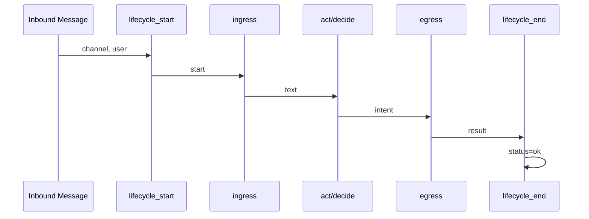
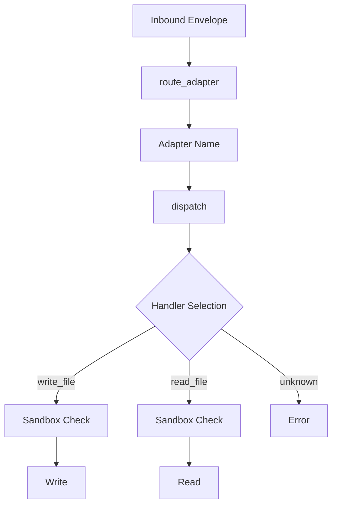
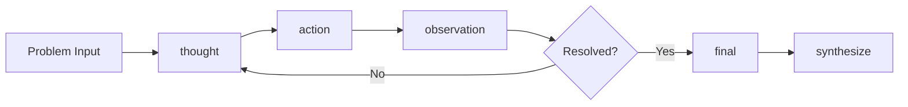
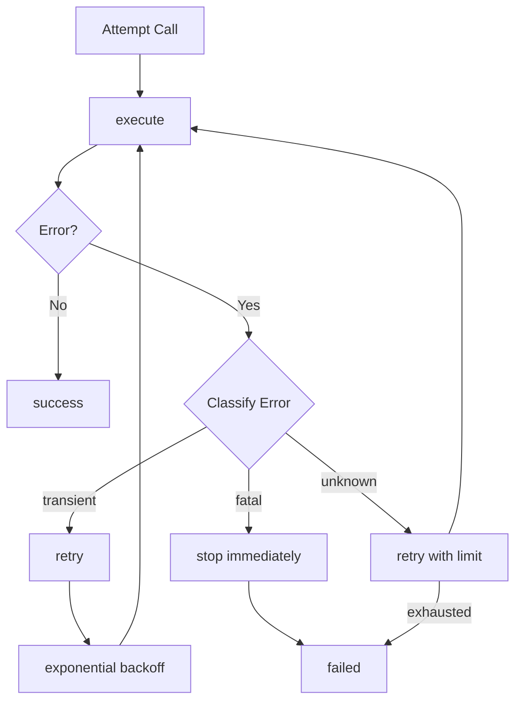
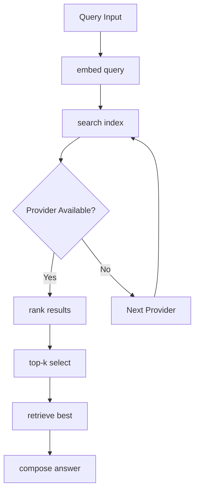
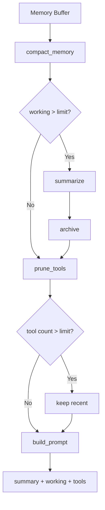
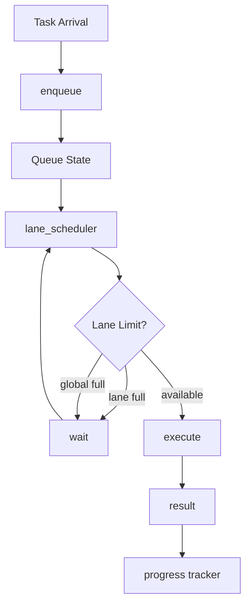
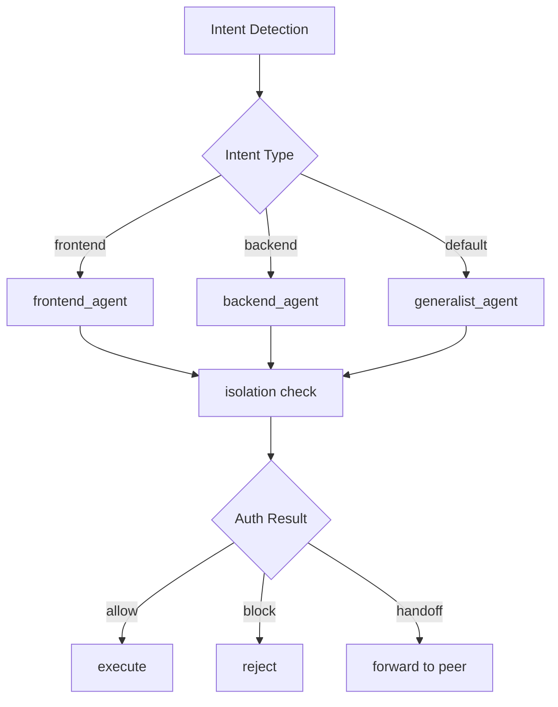
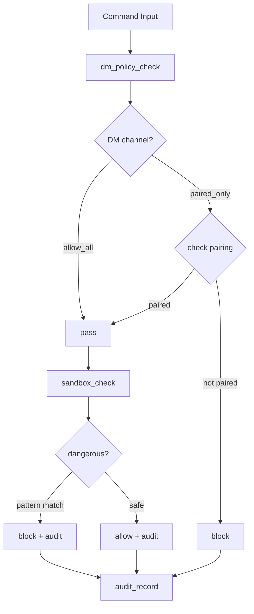

# Chapter-by-Chapter Event Diagrams

This document provides detailed ASCII diagrams showing event flows for each chapter's v3 implementation.

## Legend (How to Read)

- `[event]`: lifecycle or processing event
- `[decision?]`: conditional branch
- `[state]`: mutable runtime state (queue/session/memory)
- `[audit]`: security or trace artifact
- `-->`: main happy path
- `+-->`: branch path (fallback/error/alternate route)

Each chapter includes four teaching hooks:
1. Happy path summary
2. Failure/fallback summary
3. OpenBot anchor files
4. Related tests to validate the behavior

## Chapter 01: Gateway Event Loop

```
Inbound Message
       |
       v
[lifecycle_start] -----> [ingress] -----> [act/decide] -----> [egress] -----> [lifecycle_end]
    channel                    |              |                  |
    user                       text         intent            result
                               |              |                  |
                               v              v                  v
                         Parse command   Route action     Send response
```

- Happy path: message enters gateway lifecycle and exits with deterministic action result.
- Failure/fallback: unsupported intent falls back to `reply` action (safe default path).
- OpenBot anchors: `openbot-main/src/gateway/index.ts`, `openbot-main/src/gateway/webhooks.ts`.
- Test mapping: `chapters/01_gateway_event_loop/test_chapter01.py`.

### Mermaid Version (Ch01)



## Chapter 02: Channel Adapter Registry

```
Inbound Envelope
       |
       v
[route_adapter] --> Adapter Name
       |
       v
[dispatch] --> Handler Selection
       |
       +---> write_file --> Sandbox Check --> Write
       |
       +---> read_file  --> Sandbox Check --> Read
       |
       +---> unknown    --> Error
```

- Happy path: adapter selected, handler dispatched, operation returns deterministic output.
- Failure/fallback: unknown adapter/action returns explicit error instead of silent success.
- OpenBot anchors: `openbot-main/src/channels/registry.ts`, `openbot-main/src/channels/manager.ts`.
- Test mapping: `chapters/02_channel_adapter_registry/test_chapter02.py`.

### Mermaid Version (Ch02)



## Chapter 03: Session and DM Scope

```
Message Context
       |
       +-- is_dm? --+--> per-peer routing --> peer:{user}
       |             |
       +-- channel? -+--> per-channel-peer --> {channel}:{user}
       |
       +-- default --+--> main session --> main
```

- Happy path: policy decides stable session key for context isolation.
- Failure/fallback: missing channel/user context falls back to `main` key.
- OpenBot anchors: `openbot-main/src/session/router.ts`, `openbot-main/src/channels/manager.ts`.
- Test mapping: `chapters/03_session_and_dm_scope/test_chapter03.py`.

### Mermaid Version (Ch03)

```mermaid
flowchart TD
    A[Message Context] --> B{is_dm?}
    B -->|Yes| C[per-peer routing]
    B -->|No| D{channel?}
    C --> E[peer:{user}]
    D -->|Yes| F[per-channel-peer]
    D -->|No| G[default]
    F --> H[{channel}:{user}]
    G --> I[main session]
```

## Chapter 04: ReAct and Tool Stream

```
Problem Input
       |
       v
[thought] -----> [action] -----> [observation] -----> [final]
   |                 |                |                  |
   |            tool selection    execute result      synthesize
   |                 |                |
   +-----------------+                |
         ^                            |
         +----------------------------+
              (loop until resolved)
```

- Happy path: ReAct loop converges to final answer after bounded tool observations.
- Failure/fallback: if a tool result is insufficient, loop continues with another thought/action.
- OpenBot anchors: `openbot-main/src/agent/client.ts`, `openbot-main/src/tools/index.ts`.
- Test mapping: `chapters/04_react_and_tool_stream/test_chapter04.py`.

### Mermaid Version (Ch04)



## Chapter 05: Retry and Recovery

```
Attempt Call
       |
       v
[execute] -----> Error?
       |           |
       |           +-- transient? ----> [retry] ----> exponential backoff
       |           |                                      |
       |           |                                      v
       |           +-- fatal? --------> [stop immediately]
       |           |
       |           +-- unknown? ------> [retry with limit]
       |
       v
  [success]
```

- Happy path: transient errors are retried and eventually succeed.
- Failure/fallback: fatal errors stop immediately; retry budget exhaustion returns failed status.
- OpenBot anchors: `openbot-main/src/channels/reconnect.ts`, `openbot-main/src/tools/browser.ts`.
- Test mapping: `chapters/05_retry_and_recovery/test_chapter05.py`.

### Mermaid Version (Ch05)



## Chapter 06: Workspace Memory and Search

```
Query Input
       |
       v
[embed query] -----> [search index] -----> [rank results]
                          |                     |
                    tf-idf/cosine           top-k select
                          |                     |
                          v                     v
                    candidate docs      [retrieve best]
                                              |
                                              v
                                        [compose answer]
```

- Happy path: primary provider returns top hit and answer is composed.
- Failure/fallback: provider chain retries on empty/failed result until fallback provider succeeds.
- OpenBot anchors: `openbot-main/src/tools/search.ts`, `openbot-main/src/tools/search.test.ts`.
- Test mapping: `chapters/06_workspace_memory_and_search/test_chapter06.py`.

### Mermaid Version (Ch06)



## Chapter 07: Compaction and Pruning

```
Memory Buffer (working + tools)
       |
       v
[compact_memory] -----> working > limit?
       |                      |
       |                      +-- overflow --> [summarize] --> archive
       |                                          |
       v                                          v
[prune_tools] -----> tool count > limit? ----> [keep recent]
       |
       v
[build_prompt] = [summary] + [working] + [tools]
```

- Happy path: compact + prune keeps prompt short while preserving key context.
- Failure/fallback: oversized working memory is reduced by message count and token budget.
- OpenBot anchors: `openbot-main/src/session/store.ts`, `openbot-main/src/gateway/index.ts`.
- Test mapping: `chapters/07_compaction_and_pruning/test_chapter07.py`.

### Mermaid Version (Ch07)



## Chapter 08: Queue and Concurrency Lanes

```
Task Arrival
       |
       v
[enqueue] -----> Queue State (pending: N, done: M)
       |
       v
[lane_scheduler] -----> Lane Limit Check?
       |                      |
       |                      +-- lane full? ----> [wait]
       |                      |
       |                      +-- global full? --> [wait]
       |                      |
       |                      +-- available? ----> [execute]
       |                                              |
       v                                              v
[progress tracker] <---------------------------- [result]
```

- Happy path: tasks in different lanes overlap while same-lane tasks serialize.
- Failure/fallback: when lane/global limit is reached, tasks stay queued and resume later.
- OpenBot anchors: `openbot-main/src/session/run-queue.ts`, `openbot-main/src/gateway/index.ts`.
- Test mapping: `chapters/08_queue_and_concurrency_lanes/test_chapter08.py`.

### Mermaid Version (Ch08)



## Chapter 09: Multi-Agent Routing

```
Intent Detection
       |
       +-- frontend? ---> [frontend_agent]
       |
       +-- backend? ----> [backend_agent]
       |
       +-- default? ----> [generalist_agent]
                              |
                              v
                       [isolation check]
                       workspace/session/auth
                              |
              +---------------+---------------+
              |               |               |
              v               v               v
         [allow]         [block]       [handoff]
              |               |               |
              v               v               v
         execute          reject      forward to peer
```

- Happy path: router chooses specialized agent and records matched binding key.
- Failure/fallback: unauthorized route is blocked; unresolved tasks hand off to peer agent.
- OpenBot anchors: `openbot-main/src/session/router.ts`, `openbot-main/src/channels/manager.ts`.
- Test mapping: `chapters/09_multi_agent_routing/test_chapter09.py`.

### Mermaid Version (Ch09)



## Chapter 10: Security Sandbox Pairing

```
Command Input
       |
       v
[dm_policy_check] -----> DM channel?
       |                      |
       |                      +-- allow_all? ----> [pass]
       |                      |
       |                      +-- paired_only? --> [check pairing]
       |                                              |
       |                                              +-- paired? --> [pass]
       |                                              |
       |                                              +-- not? -----> [block]
       v
[sandbox_check] -----> dangerous pattern?
       |                      |
       |                      +-- pattern match? --> [block + audit]
       |                      |
       |                      +-- safe? ----------> [allow + audit]
       v
[audit_record] = {command, decision, reason, timestamp}
```

- Happy path: command passes policy + sandbox and is recorded in audit log.
- Failure/fallback: non-whitelisted or dangerous commands are blocked with explicit reason.
- OpenBot anchors: `openbot-main/src/security/pairing.ts`, `openbot-main/src/tools/run.ts`.
- Test mapping: `chapters/10_security_sandbox_pairing/test_chapter10.py`.

### Mermaid Version (Ch10)



## Full Pipeline Integration

```
Chapter Flow in final/openclaw_full.py

01 Gateway Loop      --> 02 Adapter Dispatch
       |                        |
       v                        v
03 Session Scope     --> 04 ReAct Reasoning
       |                        |
       v                        v
05 Retry Policy      --> 06 Memory Retrieval
       |                        |
       v                        v
07 Compaction        --> 08 Concurrent Execution
       |                        |
       v                        v
09 Multi-Agent Route --> 10 Security Enforcement
                              |
                              v
                    [aggregated result dict]
```

## Capability Layer View (Cross-Chapter)

```text
[Ingress Layer]      : Ch01, Ch02
[Session Layer]      : Ch03
[Reasoning Layer]    : Ch04, Ch05, Ch06
[Execution Layer]    : Ch07, Ch08, Ch09
[Security Layer]     : Ch10
             \------ final/openclaw_full.py aggregates all outputs ------/
```

- Integration assertion source: `tests/test_final_integration.py`.
